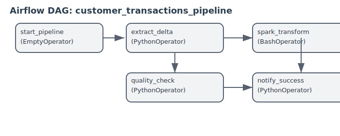
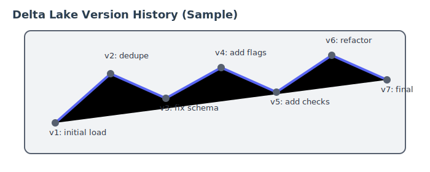
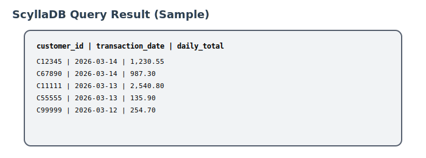

# delta-scylla-pipeline

> **A production-style data engineering pipeline** built with Delta Lake, Apache Spark, ScyllaDB, and Apache Airflow — fully containerised with Docker Compose.

[](https://python.org)
[](https://spark.apache.org)
[](https://delta.io)
[](https://scylladb.com)
[](https://airflow.apache.org)
[](https://docker.com)

---

## Table of Contents

- [Overview](#overview)
- [Architecture](#architecture)
- [Data Flow](#data-flow)
- [Project Structure](#project-structure)
- [Tech Stack](#tech-stack)
- [Prerequisites](#prerequisites)
- [Quick Start](#quick-start)
- [Running the Pipeline](#running-the-pipeline)
- [Airflow DAG](#airflow-dag)
- [Delta Lake Versioning](#delta-lake-versioning)
- [ScyllaDB Schema](#scylladb-schema)
- [Data Quality](#data-quality)
- [Port Reference](#port-reference)
- [Troubleshooting](#troubleshooting)

---

## Overview

This pipeline simulates a real-world financial transactions ETL system. It:

1. **Generates** 1,200+ synthetic customer transactions (with intentional duplicates and bad data)
2. **Stores** raw data in a Delta Lake table with full ACID guarantees and version history
3. **Transforms** data using Apache Spark — deduplicates, validates, extracts dates, aggregates daily totals
4. **Loads** clean aggregated results into ScyllaDB for high-speed querying
5. **Orchestrates** the entire pipeline via an Apache Airflow DAG that runs daily

---

## Architecture

```
┌─────────────────────────────────────────────────────────────────────────┐
│                        Docker Compose Environment                        │
│                                                                          │
│  ┌───────────────────────────────────────────────────────────────────┐  │
│  │           Apache Airflow  (scheduler + webserver :8080)           │  │
│  │         Orchestrates all tasks · daily schedule 01:00 UTC         │  │
│  └──────────────┬─────────────────────┬──────────────────┬───────────┘  │
│                 │ Task 1              │ Task 2           │ Task 3        │
│                 ▼                     ▼                  ▼              │
│  ┌──────────────────┐   ┌─────────────────────┐   ┌──────────────────┐ │
│  │  Data Generator  │   │    PostgreSQL        │   │  Quality Check   │ │
│  │  Python + Faker  │   │  Airflow metadata DB │   │  Row count gate  │ │
│  └────────┬─────────┘   └─────────────────────┘   └────────┬─────────┘ │
│           │                                                 │           │
│           ▼                                                 │           │
│  ┌──────────────────┐                                       │           │
│  │    Delta Lake    │◄──────── bind mount ──────────────────┘           │
│  │  ACID + versioning│   ./data/delta-lake/customer_transactions        │
│  │  _delta_log/     │                                                   │
│  │  Parquet files   │                                                   │
│  └────────┬─────────┘                                                   │
│           │                                                             │
│           ▼  spark-submit                                               │
│  ┌──────────────────────────────────────────┐                          │
│  │           Apache Spark ETL               │                          │
│  │  ├─ dropDuplicates(transaction_id)       │                          │
│  │  ├─ filter(amount > 0)                  │                          │
│  │  ├─ to_date(timestamp)                  │                          │
│  │  ├─ groupBy(customer_id, date)          │                          │
│  │  └─ sum(amount) → daily_total           │                          │
│  │                                          │                          │
│  │  master: spark://spark-master:7077       │                          │
│  └─────────────────┬────────────────────────┘                          │
│                    │                                                    │
│                    ▼  Cassandra connector                               │
│  ┌──────────────────────────────────────────┐                          │
│  │              ScyllaDB :9042              │                          │
│  │  keyspace:  transactions_ks              │                          │
│  │  table:     daily_customer_totals        │                          │
│  │  PK:        (customer_id, date)          │                          │
│  └──────────────────────────────────────────┘                          │
│                                                                          │
└─────────────────────────────────────────────────────────────────────────┘

Host Machine
  └── ./data/delta-lake/    ← bind-mounted into Spark + Airflow containers
  └── ./dags/               ← Airflow scans this folder for DAG files
  └── ./spark_jobs/         ← ETL scripts mounted into Spark container
  └── ./scylla/init.cql     ← Schema init run at container startup
```

---

## Data Flow

```
[generate_data.py]
      │
      │  ~1,260 rows (incl. ~5% dupes, ~3% zero amounts, ~2% negative)
      ▼
[Delta Lake table: customer_transactions]
      │  Parquet + _delta_log/  (ACID · versioned · time-travel)
      │
      ▼  spark-submit
[spark_etl.py — Transformations]
      │
      ├─ Step 1: dropDuplicates(['transaction_id'])   → removes ~60 rows
      ├─ Step 2: filter(col('amount') > 0)            → removes ~36 rows
      ├─ Step 3: withColumn('transaction_date', to_date('timestamp'))
      └─ Step 4: groupBy('customer_id','transaction_date')
                 .agg(sum('amount').alias('daily_total'))
      │
      │  ~300–600 aggregated rows
      ▼
[ScyllaDB: transactions_ks.daily_customer_totals]
      │
      │  customer_id (partition key)  +  transaction_date (clustering key)
      ▼
[Apache Airflow DAG: quality_check]
      │  COUNT(*) from ScyllaDB — fails pipeline if < 10 rows
      ▼
[notify_success / notify_failure]
```

---

## Project Structure

```
delta-scylla-pipeline/
├── docker-compose.yml              # All 8 services
├── README.md                       # This file
│
├── dags/
│   └── pipeline_dag.py             # Airflow DAG (5 tasks, daily schedule)
│
├── spark_jobs/
│   └── spark_etl.py                # Spark ETL: extract → transform → load
│
├── scripts/
│   ├── generate_data.py            # Faker data generator → Delta Lake
│   ├── delta_versioning_demo.py    # Delta Lake time travel demo
│   ├── setup.sh                    # One-shot environment setup
│   └── run_pipeline.sh             # Run full pipeline manually
│
├── scylla/
│   └── init.cql                    # Keyspace + table DDL
│
├── data/
│   └── delta-lake/                 # Bind-mounted into containers
│       └── customer_transactions/  # Delta table written here
│
└── sample_data/                    # Generated sample CSVs (for reference)
```

---

## Tech Stack

| Component | Technology | Version | Role |
|-----------|-----------|---------|------|
| Data generation | Python + Faker | 3.10 | Creates synthetic transactions with data quality issues |
| Storage layer | Delta Lake | 2.4.0 | ACID transactions, versioning, time travel on raw data |
| Processing engine | Apache Spark | 3.4.1 | Distributed ETL — dedupe, validate, aggregate |
| Output database | ScyllaDB | 5.4 | High-speed NoSQL store for aggregated daily totals |
| Orchestration | Apache Airflow | 2.8.1 | Schedules, monitors, retries the full pipeline |
| Metadata store | PostgreSQL | 15 | Airflow state (DAG runs, task instances, XCom) |
| Containerisation | Docker Compose | v2 | Runs all services locally with one command |

---

## Prerequisites

| Tool | Minimum Version | Check |
|------|----------------|-------|
| Docker Desktop | 24.x | `docker --version` |
| Docker Compose | 2.x | `docker compose version` |
| Free RAM | 6 GB | — |
| Free Disk | 5 GB | — |

No Python installation needed on the host — everything runs inside containers.

---

## Quick Start

### 1. Clone the repository

```bash
git clone https://github.com/yourusername/delta-scylla-pipeline.git
cd delta-scylla-pipeline
```

### 2. Create local directories and set permissions

```bash
mkdir -p data/delta-lake/customer_transactions sample_data
chmod -R 777 data/
```

### 3. Start all services

```bash
docker-compose up -d
```

Wait approximately **2–3 minutes** for ScyllaDB and Airflow to fully initialise.

### 4. Verify all services are healthy

```bash
docker-compose ps
```

Expected output — all services should show `Up` or `healthy`:

```
NAME                 STATUS
airflow-webserver    Up (healthy)
airflow-scheduler    Up
scylladb             Up (healthy)
spark-master         Up
spark-worker         Up
postgres             Up (healthy)
scylla-init          Exited (0)   ← expected, init job completes and exits
```

### 5. Open the UIs

| Service | URL | Credentials |
|---------|-----|------------|
| Airflow | http://localhost:8080 | admin / admin |
| Spark Master | http://localhost:8081 | — |

---

## Running the Pipeline

### Option A — Automated (via Airflow UI)

1. Open http://localhost:8080
2. Find the `customer_transactions_pipeline` DAG
3. Toggle it **ON** (unpause)
4. Click **Trigger DAG** to run immediately
5. Watch tasks turn green: `extract_delta → spark_transform → quality_check → notify_success`

### Option B — Manual (docker exec)

**Step 1: Generate data into Delta Lake**

```bash
docker exec spark-master \
  spark-submit \
    --master local[*] \
    --packages io.delta:delta-core_2.12:2.4.0 \
    --conf spark.sql.extensions=io.delta.sql.DeltaSparkSessionExtension \
    --conf spark.sql.catalog.spark_catalog=org.apache.spark.sql.delta.catalog.DeltaCatalog \
    /opt/spark_jobs/../scripts/generate_data.py
```

**Step 2: Run the Spark ETL**

```bash
docker exec spark-master \
  spark-submit \
    --master spark://spark-master:7077 \
    --packages io.delta:delta-core_2.12:2.4.0,com.datastax.spark:spark-cassandra-connector_2.12:3.4.0 \
    --conf spark.sql.extensions=io.delta.sql.DeltaSparkSessionExtension \
    --conf spark.sql.catalog.spark_catalog=org.apache.spark.sql.delta.catalog.DeltaCatalog \
    --conf spark.cassandra.connection.host=scylladb \
    --conf spark.cassandra.connection.port=9042 \
    /opt/spark_jobs/spark_etl.py
```

**Step 3: Verify results in ScyllaDB**

```bash
docker exec -it scylladb cqlsh
```

```sql
USE transactions_ks;
SELECT COUNT(*) FROM daily_customer_totals;
SELECT * FROM daily_customer_totals LIMIT 10;
```

### Option C — One script

```bash
chmod +x scripts/run_pipeline.sh
./scripts/run_pipeline.sh
```

---

## Airflow DAG

The DAG `customer_transactions_pipeline` runs daily at **01:00 UTC**.

```
extract_delta ──► spark_transform ──► quality_check ──► notify_success
                                                    └──► notify_failure
```

| Task | Operator | What it does |
|------|----------|-------------|
| `extract_delta` | PythonOperator | Checks Delta table exists and is non-empty. Pushes row count to XCom. |
| `spark_transform` | PythonOperator | Runs `spark_etl.py` — full ETL pipeline. 25-minute timeout. |
| `quality_check` | BranchPythonOperator | Counts rows in ScyllaDB. Routes to success or failure branch. |
| `notify_success` | PythonOperator | Logs final row counts from XCom. |
| `notify_failure` | PythonOperator | Raises error — marks DagRun as failed. |

**DAG configuration:**

| Setting | Value |
|---------|-------|
| Schedule | `0 1 * * *` (daily 01:00 UTC) |
| Retries per task | 2 |
| Retry delay | 5 minutes |
| Catchup | Disabled |
| Max active runs | 1 |

---

## Output Screenshots

### Airflow DAG (UI)


### Delta Lake History (Sample)


### ScyllaDB Result (Sample)


---

## Delta Lake Versioning

Run the versioning demo to see time travel in action:

```bash
docker exec spark-master \
  spark-submit \
    --master local[*] \
    --packages io.delta:delta-core_2.12:2.4.0 \
    --conf spark.sql.extensions=io.delta.sql.DeltaSparkSessionExtension \
    --conf spark.sql.catalog.spark_catalog=org.apache.spark.sql.delta.catalog.DeltaCatalog \
    /opt/spark_jobs/../scripts/delta_versioning_demo.py
```

This demonstrates:

- **Table history** — `DeltaTable.forPath(spark, path).history().show()`
- **Time travel** — `spark.read.format("delta").option("versionAsOf", 0).load(path)`
- **UPDATE** — creates a new version in the transaction log
- **DELETE** — creates another version (tombstone semantics)
- **MERGE (upsert)** — atomic insert-or-update
- **VACUUM** — cleans files older than the retention period

---

## ScyllaDB Schema

```sql
CREATE KEYSPACE IF NOT EXISTS transactions_ks
WITH replication = {
    'class': 'SimpleStrategy',
    'replication_factor': 1
};

CREATE TABLE IF NOT EXISTS transactions_ks.daily_customer_totals (
    customer_id      TEXT,
    transaction_date DATE,
    daily_total      FLOAT,
    PRIMARY KEY (customer_id, transaction_date)
)
WITH CLUSTERING ORDER BY (transaction_date DESC);
```

**Why this schema?**

| Design Decision | Reasoning |
|----------------|-----------|
| `customer_id` as partition key | All dates for one customer stored on the same node — single partition scan per customer query |
| `transaction_date` as clustering key | Dates sorted within each partition — range queries like "last 30 days for C00001" are sequential reads |
| `CLUSTERING ORDER BY DESC` | Latest transactions returned first without client-side sorting |
| `INSERT` = upsert | Cassandra/ScyllaDB INSERT automatically updates on PRIMARY KEY collision — pipeline is idempotent |

**Connect to ScyllaDB:**

```bash
docker exec -it scylladb cqlsh
```

```sql
DESCRIBE KEYSPACES;
USE transactions_ks;
DESCRIBE TABLES;
SELECT * FROM daily_customer_totals WHERE customer_id = 'C00001';
SELECT COUNT(*) FROM daily_customer_totals;
```

---

## Data Quality

The data generator intentionally injects data quality issues to test the ETL pipeline:

| Issue | Volume | Cause (real world) | ETL fix |
|-------|--------|-------------------|---------|
| Duplicate `transaction_id` | ~5% of rows | Network retries, double submissions | `dropDuplicates(['transaction_id'])` |
| Zero `amount` | ~3% of rows | Test transactions, failed payments | `filter(col('amount') > 0)` |
| Negative `amount` | ~2% of rows | Refunds, data entry errors | `filter(col('amount') > 0)` |

**Quality gate:** After loading to ScyllaDB, the Airflow `quality_check` task runs `COUNT(*)` on the table. If fewer than 10 rows are found, the pipeline fails immediately — surfacing the issue rather than silently producing empty data.

---

## Port Reference

| Service | Host Port | Container Port | Purpose |
|---------|-----------|---------------|---------|
| Airflow UI | 8080 | 8080 | Web interface — DAG management |
| Spark Master UI | 8081 | 8080 | Cluster overview — jobs, workers |
| Spark Master RPC | 7077 | 7077 | spark-submit connection point |
| ScyllaDB CQL | 9042 | 9042 | CQL queries via cqlsh or drivers |
| ScyllaDB REST | 10000 | 10000 | REST API |

---

## Troubleshooting

### ScyllaDB not ready after startup

```bash
docker logs scylladb --tail 50
docker exec scylladb nodetool status
```

ScyllaDB takes ~60 seconds to be CQL-ready. The `scylla-init` container waits for the health check before running `init.cql`.

---

### Spark job fails with `ClassNotFoundException` (Cassandra connector)

Ensure you pass the full `--packages` flag:

```
--packages io.delta:delta-core_2.12:2.4.0,com.datastax.spark:spark-cassandra-connector_2.12:3.4.0
```

The `_2.12` suffix must match your Spark build's Scala version (Spark 3.x uses Scala 2.12).

---

### Airflow DAG not appearing in UI

```bash
# List all DAGs the scheduler sees
docker exec airflow-scheduler airflow dags list

# Check for syntax errors in the DAG file
docker exec airflow-scheduler python /opt/airflow/dags/pipeline_dag.py
```

---

### Permission denied on `./data/delta-lake`

```bash
chmod -R 777 ./data/
```

The Spark container runs as a non-root user (UID 1001 in Bitnami images). The bind-mounted directory must be world-writable.

---

### Delta table not found when running ETL

The ETL reads from Delta Lake — you must run the data generator first:

```bash
# Run generate_data.py (Step 1) before spark_etl.py (Step 2)
./scripts/run_pipeline.sh
```

---

### Reset everything (clean slate)

```bash
docker-compose down -v          # removes containers AND named volumes
rm -rf ./data/delta-lake/*      # removes Delta Lake files
docker-compose up -d            # fresh start
```

---

## Why ScyllaDB instead of PostgreSQL?

Our output data follows a **time-series by customer** pattern — one row per `(customer_id, date)`. ScyllaDB stores all dates for one customer physically together on the same node (partition key = `customer_id`), making per-customer queries a single partition scan.

Compared to PostgreSQL:

| Aspect | ScyllaDB | PostgreSQL |
|--------|----------|-----------|
| Write throughput | Millions/sec (MemTable → async disk) | Thousands/sec (WAL + row locking) |
| Upsert | Free (INSERT = upsert on PK) | Needs `ON CONFLICT DO UPDATE` |
| Horizontal scale | Add nodes to ring | Requires sharding setup |
| Query model | Partition-key optimised | General relational (JOINs, subqueries) |
| Best for | High-volume time-series | Complex relational queries |

For 80 customers × 60 days this difference is small. At 10 million customers × 365 days (3.65 billion rows) — ScyllaDB scales linearly, PostgreSQL does not.

---

## License

MIT
